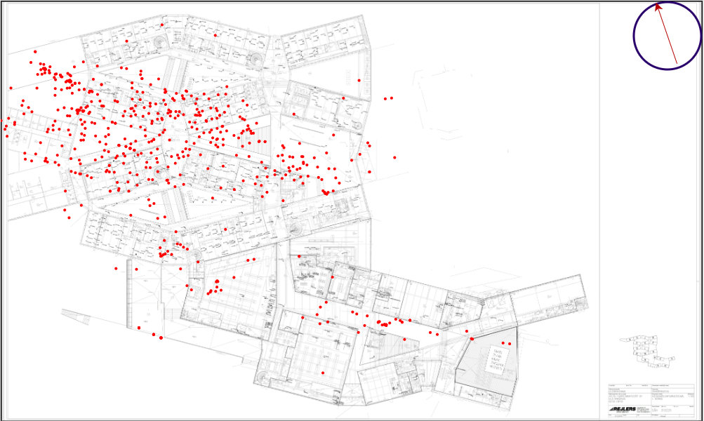

# FriendFi - The guide you to whatever you want most in the world, a friend

## Idea 
Finding people at venues can be a pain, and when you want to find someone quickly, messages like "I'm close to the stage" doesn't really make sense. This application attempts to mitigate the problem by tracking the last known location of every device present at the venue. 

## Description
The web application will track the last known location of every device by mac adress. The localization is done by triangulating rssid signal strengths of the device at various access points around the event. The data can also be used to determine what areas are congested for event organizers, or whether or not the queue is long to the cafeteria or not. 

## Structure
RSSID is fetched from a provided api, along with the triangulated position. The results for individual mac adresses are stored in a SQL database and provided to our web app through our own api hosted on a flask backend. The interface has a compass to whatever you want most, or whoever you want to track.  

## Demo

This project was made at the [Junction 2019](https://2019.hackjunction.com/) Hackathon, Helsinki, Finland.
